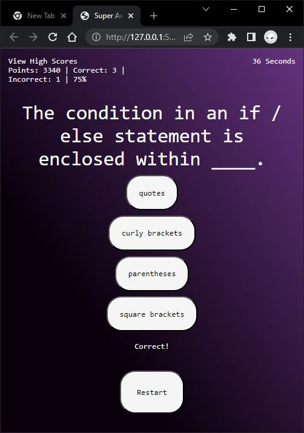

# Super Awesome Quiz

## Description
I wanted to make a simple quiz with some interesting visuals that could be modified by other people.

I also wanted to experiment with AI, because most of the other quizzes available currently, only have a few questions. They don't cover all of the necessary facts involving JavaScript. By providing a prompt to generate an array of questions with the correct structure, I was able to create 30 questions about JavaScript in just a few minutes. The files are not used in the final version of the project, but can be enabled by uncommenting line 44 in the index.html file, which imports the questionsAI.js file. I am not one to decide the accuracy of the questions and answers, but it seemed correct.

In the future, you could create the same questions using a prompt such as,

```
Create an array with [number of questions] elements with the constant name "questionsAI" with questions as each element about [specific subject]. In each element, "question" will be the key of the question text, "answers" will the key to an array of [number of answers] answer texts, and "correct" as the key of the value that contains the index of the correct answer text.
```

I learned a lot about accessing the DOM and creating HTML elements. I also had fun playing around with the CSS to get what I think were pretty neat effects!

## Acceptance Criteria

```
GIVEN I am taking a code quiz
WHEN I click the start button
✅ THEN a timer starts and I am presented with a question
WHEN I answer a question
✅ THEN I am presented with another question
WHEN I answer a question incorrectly
✅ THEN time is subtracted from the clock (5 seconds, specified in a global variable)
WHEN all questions are answered or the timer reaches 0
✅ THEN the game is over
WHEN the game is over
✅ THEN I can save my initials and my score
```

### Video of Start to Game Over
https://user-images.githubusercontent.com/1228604/231559225-4c08bf68-0456-41c5-96ab-f31f5836bee3.mp4

### Start Screen


### Gameplay



### Game Over


### High Scores


## Credits

questionsAI.js and some comments were generated by using Copilot and ChatGPT, all other HTML, CSS, and JavaScript were written by Mark Ciubal.